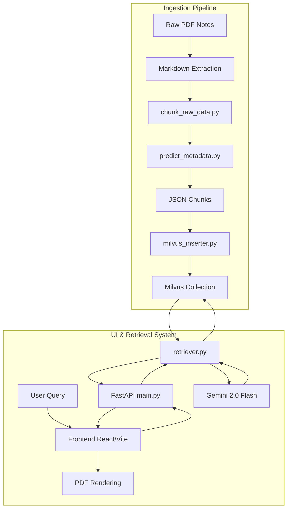
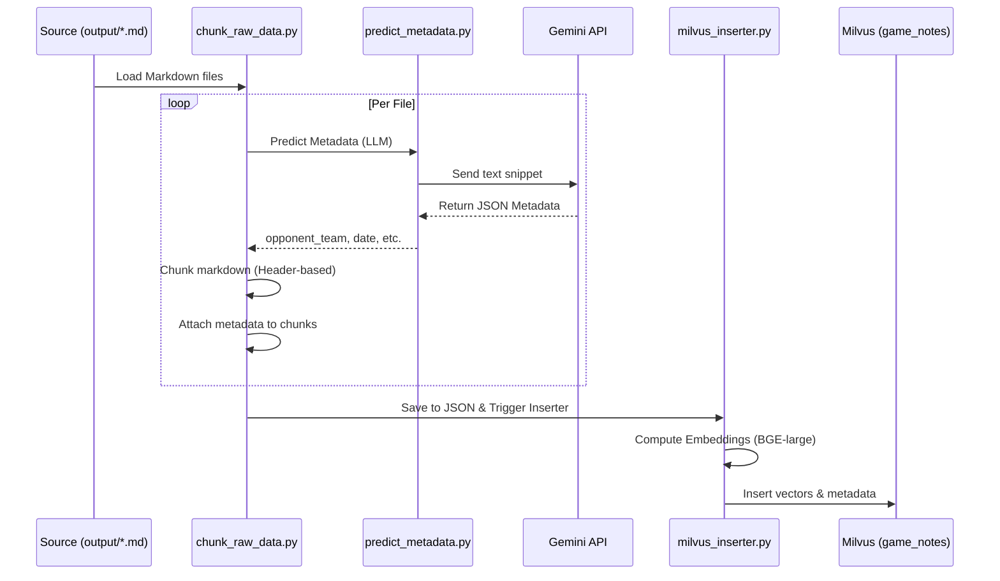
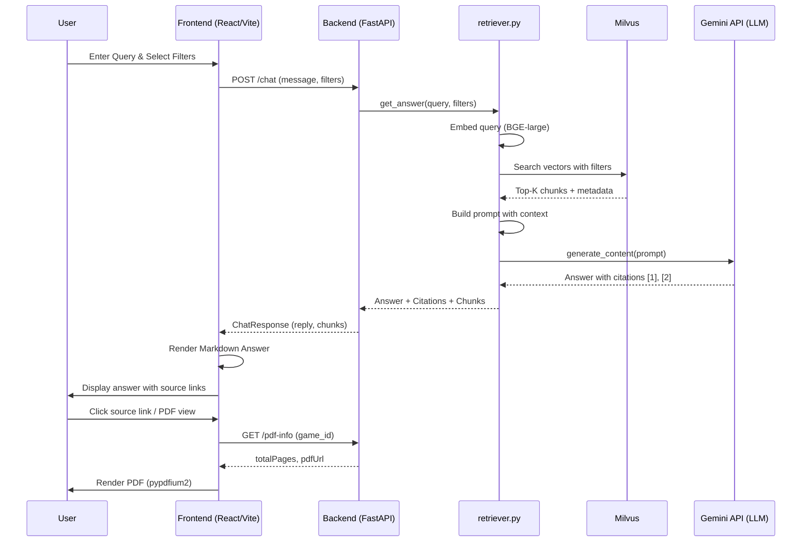

# Game Note RAG System

A Retrieval-Augmented Generation (RAG) system designed to process college football game notes (PDFs), store them in Milvus, and provide a conversational interface for sports analysts to query historical data and get "nostalgia" insights.

---

## 🏗️ Architecture Overview

The system is divided into two main components:

1. **Ingestion Pipeline:** Handles raw data processing, metadata  extraction, chunking, and vector database insertion.
2. **UI & Retrieval System:** Handles user queries, semantic search, LLM-based answer generation, and frontend rendering.



---

## 📥 Milvus Ingestion Pipeline

The ingestion pipeline is responsible for converting raw game notes (Markdown format) into semantic vectors and metadata.

### Workflow



### Key Components

- **Metadata Prediction (`predict_metadata.py`):** Uses Gemini to extract `opponent_team`, `game_date`, `home_away`, and `conference`.
- **Chunking Logic (`chunk_raw_data.py`):** Header-based splitting followed by recursive character splitting (max 1500 chars).
- **Milvus Insertion (`milvus_inserter.py`):** Generates 1024-dim embeddings using `BAAI/bge-large-en-v1.5` and performs batch insertion.

---

## 🔍 Retrieval & UI Rendering

The retrieval system provides a conversational interface with grounded citations and source verification.

### Workflow



### Key Components

- **Backend API (`main.py`):** FastAPI endpoints for chat, filter options, and PDF serving.
- **Retrieval Logic (`retriever.py`):** Semantic search in Milvus with boolean filtering and LLM answer synthesis.
- **Frontend (`frontend/`):** React/Vite app with Markdown support and integrated PDF viewer for ground-truth verification.

---

## 🛠️ Tech Stack

- **Backend:** Python, FastAPI
- **LLM:** Google Gemini 2.0 Flash
- **Vector Database:** Milvus (HNSW index, Cosine similarity)
- **Embeddings:** `BAAI/bge-large-en-v1.5` via `SentenceTransformers`
- **Frontend:** React with Vite
- **PDF Processing:** `pypdfium2`

---

## 📂 Project Structure

```text
game-note-ui/
├── main.py              # FastAPI server (Chat & PDF endpoints)
├── retriever.py         # Core RAG logic (Search + Gemini LLM)
├── milvus_inserter.py   # Embedding generation & Milvus data insertion
├── predict_metadata.py  # LLM-based metadata prediction for game notes
├── chunk_raw_data.py    # Header-based & recursive character chunking
├── milvus_schema.py     # Milvus collection & HNSW index definition
├── requirements.txt     # Python backend dependencies
├── .env                 # Environment configurations (API keys, Milvus URI)
├── data/                # Final processed JSON chunks for insertion
├── doc/                 # Source game note PDFs (organized by team)
├── output/              # Extracted Markdown versions of game notes
├── scripts/             # Utility and automation scripts
│   └── dev/             # Debugging, testing, and validation scripts
└── frontend/            # React + Vite application
    ├── src/             # Frontend source code (Components, Hooks, App)
    ├── index.html       # Web application entry point
    └── vite.config.js   # Vite build & proxy configuration
```

---

## 🚀 Deploy MCP Server to AWS Lambda

This repo includes a deploy script for the MCP server in `mcp_server.py`.

### Files used for Lambda MCP

- `mcp_server.py`: MCP tools (`get_filter_options`, `search_game_notes`, `get_pdf_info`)
- `lambda_mcp_handler.py`: Lambda entrypoint for FastMCP
- `requirements.lambda.txt`: minimal dependencies for Lambda package
- `scripts/deploy_mcp_lambda.sh`: one-command deploy/update script

### Prerequisites

- AWS CLI configured with profile `alonzo-deploy`
- A Lambda execution role ARN (first deploy only), for example:
  - `arn:aws:iam::845810202069:role/Bulk_load_Lambda1`
- Python interpreter `>= 3.10` (3.12 recommended)

> You can use your current shell python as long as it is compatible:
>
> `PYTHON_BIN="$(which python)"`

### First-time deploy (create Lambda if missing)

From repo root:

```bash
LAMBDA_ROLE_ARN=arn:aws:iam::845810202069:role/Bulk_load_Lambda1 \
PYTHON_BIN="$(which python)" \
./scripts/deploy_mcp_lambda.sh game-note-mcp-lambda us-east-2
```

### Subsequent deployments (same Lambda)

Whenever MCP/project code changes:

```bash
PYTHON_BIN="$(which python)" \
./scripts/deploy_mcp_lambda.sh game-note-mcp-lambda us-east-2
```

### Create/verify Function URL

```bash
aws lambda create-function-url-config \
  --function-name game-note-mcp-lambda \
  --auth-type NONE \
  --region us-east-2 \
  --profile alonzo-deploy 2>/dev/null || true

aws lambda add-permission \
  --function-name game-note-mcp-lambda \
  --statement-id AllowPublicFunctionUrlInvoke \
  --action lambda:InvokeFunctionUrl \
  --principal "*" \
  --function-url-auth-type NONE \
  --region us-east-2 \
  --profile alonzo-deploy 2>/dev/null || true

aws lambda add-permission \
  --function-name game-note-mcp-lambda \
  --statement-id AllowPublicInvokeViaFunctionUrl \
  --action lambda:InvokeFunction \
  --principal "*" \
  --invoked-via-function-url \
  --region us-east-2 \
  --profile alonzo-deploy 2>/dev/null || true
```

Get URL:

```bash
aws lambda get-function-url-config \
  --function-name game-note-mcp-lambda \
  --region us-east-2 \
  --profile alonzo-deploy \
  --query FunctionUrl \
  --output text
```

### Cursor MCP configuration

Use `streamable_http` with the `/mcp` path:

```json
{
  "mcpServers": {
    "game-note-mcp": {
      "transport": "streamable_http",
      "url": "https://uctwkbjxbjjdncwpn2x2j2awwm0fvvzs.lambda-url.us-east-2.on.aws/mcp"
    }
  }
}
```

### Troubleshooting

- `No matching distribution found for mcp`:
  - your Python is too old (<3.10). Use a newer interpreter in `PYTHON_BIN`.
- `Session not found`:
  - fixed by running FastMCP in stateless HTTP mode for Lambda.
- `Invalid Host header` (421):
  - transport security host validation mismatch. Current setup disables DNS rebinding protection by default in Lambda.
