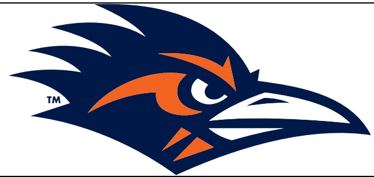

# 2024 UTSA Roadrunners Football UTSA vs. Temple Friday, Nov. 22 Alamodome·San Antonio, Texas UTSA Postgame Notes

## TEAM RECORDS AND SERIES NOTES

- UTSA improved to 6-5, including a 4-3 mark in American Athletic Conference play, earning bowl eligibility in the process for the fifth time in five years under Coach Traylor. Temple fell to 3-8 on the year and is now 2-5 record in league action.

- This marked the second meeting between UTSA and Temple.

- UTSA leads the series, 2-0.

- UTSA has won 10 straight games in the Alamodome and 17 of the last 18 home contests.

UTSA has tied the school record 10-game winning streak set in 2020-21.

The Roadrunners are now 55-30 (.647) all-time in the Alamodome.

- UTSA is 9-4 all-time in Friday games.

- The Roadrunners are 11-7 all-time in games played on weekdays.

- In the Jeff Traylor era, UTSA is now:

○ 45-19 (.703) overall.

- Taylor's 45 wins represent the most of any active FBS head coach hired in 2020.

31-7 (.816) in regular-season conference games.

29-3 (.906) at home.

16-2 (.889) overall and 11-0 at home in the month of November.

8-3 (.727) in Friday games.

## TEAM NOTES

- The Roadrunners set a new school record with 16 tackles for loss.

- UTSA extended its streak of consecutive games with a takeaway to 21.

- The Roadrunners now have 19 takeaways this season, nine fumble recoveries and 10 interceptions.

- The Roadrunners recorded six sacks on the evening, one shy of the program record.

- UTSA now has registered a sack in 21 straight games.

- UTSA has held opponents to 100 or fewer rushing yards eight times this season.

- UTSA scored 51 points for a new season-high

It was the first 50-point game since UTSA posted 51 against Louisiana Tech on Nov. 12, 2022

- UTSA recorded 529 yards of total offense,309 on the ground and 220 through the air.

The Roadrunners have now recorded over 300 rushing yards in back-to-back games, and 309 represents a new season high.

This marks the first time in program history with back-to-back 300-yard rushing games and just the third time with two in the same season.

- The Roadrunners logged three of the team's four longest plays of the season in this game.

- UTSA gained at least 500 yards of offense for the second straight game and fourth time this year.

## INDIVIDUAL NOTES

- Senior OLB Jimmori Robinson posted seven tackles, including 5.5 for loss and four sacks.

Robinson broke the single-game TFLs record of 4.5 set by Robert Singletary against FIU on Oct 10, 2014.

He tied the single-game sacks standard set by Marlon Smith vs. McMurry on Sept. 10, 2011

- Junior CB Zah Frazier had two interceptions, a pass breakup, a hurry and two tackles.

Frazier now has a school-record six interceptions this season, eclipsing Clifford Chattman's previous mark of five set in 2022.

This is his second straight and third overall game this season with two INTs.

- Senior ILB Martavius French tied Jamal Ligon for the team lead with seven tackles.

This marks the seventh time this season that French has paced the Roadrunners.

Senior S Elliott Davison racked up five tackles and a pass breakup.

Senior DL Asyrus Simon and redshirt sophomore Camron Cooper each posted a sack.

- Redshirt sophomore $B Bryce Grays posted the first forced fumble of his career.

- Senior RB Robert Henry Jr. recorded his second straight 100-yard rushing game with 178 yards and two scores.

Henry's rushing yardage total now ranks seventh on the school's single-game rushing chart.

His 88-yard run in the second quarter is the second-longest rush in school history behind Jarveon Williams' 92-yard dash against Southern Miss on Oct. 8, 2016

His 75-yard TD dash in the second quarter is the longest rush by a UTSA quarterback in school history,breaking Frank Harris' 71-yard record against North Texas in 2020.

- Senior WR/KR Chris Carpenter returned a kickoff 97 yards for a touchdown in the second quarter.

- Carpenter now has the only two kickoff return TDs in school history, as he also had a 97-yard return for a score vs. Texas Southern on Sept.24, 2022.

- Sophomore WR David Amador II hauled in seven receptions on seven targets for 63 yards

- Senior WR Willie McCoy caught three passes for 48 yards and a score.

## ADDITIONAL NOTES

- UTSA's captains today were senior WR Chris Carpenter, senior RB Robert Henry Jr. and senior C CJ James Jr.

- UTSA improved to 4-0 when wearing black uniforms, including 3-0 this season.

- Today's attendance was 20,121.

UTSA now has drawn 2,114,786 fans for 85 home games in its 14-year history, an average of 24,880 per game