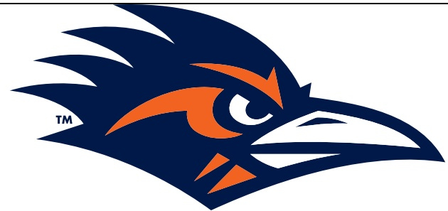

## TEAM RECORDS AND SERIES NOTES

- UTSA fell to 2-3 overall and 0-1 in the American Athletic Conference. East Carolina improved to 3-2 and 1-0.

- This marked the second meeting between UTSA and East Carolina.

The series is now even at 1-1.

- Head coach Jeff Traylor has matched Larry Coker for the most games coached in program history with his 58th today.

- In the Jeff Traylor era, UTSA is now:

41-17 (.707) overall.

27-5 (.844) in regular season conference games.

29-5 (.853) versus conference competition when including the 2021 and 2022 Conference USA Championship Games.

4-1 in conference openers.

## TEAM NOTES

- UTSA tallied 456 yards of offense and ran 89 plays.

The Roadrunners passed for 286 yards and rushed for 170.

- UTSA held East Carolina to 47 rushing yards, a season low for opponents.

The Roadrunners have held two straight and three overall opponents to 51 or fewer rushing yards in 2024.

- The Roadrunners recorded two interceptions and now have a takeaway in 15 consecutive games.

- UTSA now has recorded a sack in 15 straight contests after Jamal Ligon and Ronald Triplette each recorded one today.

## INDIVIDUAL NOTES

- Senior ILB Martavius French led UTSA with eight total tackles, including six solo stops and a tackle for loss.

- French now has 24 tackles, 4.5 TFLs, two pass breakups, one quarterback hurry and a sack this season.

His 24 stops rank second on the team this year.

- Junior CB Zah Frazier picked off two passes, both in the second half.

He is now the fifth Roadrunner and first since Clayton Johnson against Rice in 2017 to have two interceptions in a game

- Senior ILB Jamal Ligon posted five total tackles, one sack, one forced fumble and a quarterback hurry.

o Ligon now has 16 total tackles, two TFLs and a sack in 2024.

Ligon became the second Roadrunner to reach 300 career tackles, and he now has 301 in 55 games.

- Sophomore QB Owen McCown completed 24 of 49 passes for 251 yards and a touchdown.

McCown now has thrown for 1,054 yards and seven TDs on 101-of-164 passing this season

- Redshirt freshman RB Brandon High Jr. rushed for 92 yards and a touchdown on only seven attempts.

High's 66-yard TD run in the fourth quarter was his second career score and is tied for UTSA's longest play of the season.

Willie McCoy caught four passes for 91 yards with a long of 66, and he had 53 yards after the catch.

McCoy's 66-yard reception is tied for UTSA's longest play of the season

- Senior TE Oscar Cardenas had two receptions, including a 5-yard TD catch in the first half.

His TD grab was the eighth of his career.

Cardenas played in his team-best 62nd game today.

- Junior PK Chase Allen made both field-goal attempts today, as he was good from 23 and 35 yards.

Allen now has made his last three field-goal attempts and all 11 extra-point tries this season.

## ADDITIONAL NOTES

- UTSA's captains were senior DL Brandon Brown, senior DL Joe Evans and senior ILB Jamal Ligon.