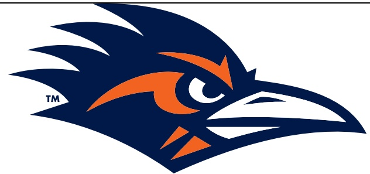

# 2024 UTSA Roadrunners Football UTSA vs. North Texas Friday, Nov. 15 Alamodome·San Antonio, Texas UTSA Postgame Notes

## TEAM RECORDS AND SERIES NOTES

- UTSA improved to 5-5 on the season, with a 3-3 mark in American Athletic Conference play. North Texas fell to 5-5 and 2-4 in The American.

- This marked the 13th meeting between UTSA and North Texas, marking the most-played series on the books for the Roadrunners.

UTSA now leads the all-time series 8-5.

Today's 48-27 final score is identical to the last Alamodome matchup between the two teams, the 2022 Conference USA Championship Game.

UTSA is one shy of the school record 10-game winning streak set in 2020-21.

- UTSA has won nine straight in the Alamodome and 16 of the last 17 home games.

The Roadrunners are now 54-30 (.643) all-time in the Alamodome.

- UTSA is 8-4 all-time in Friday games.

- The Roadrunners are 10-7 all-time in games played on weekdays.

- In the Jeff Traylor era, UTSA is now:

44-19 (.698) overall.

- Traylor's 44 wins represent the most of any active FBS head coach hired in 2020.

28-3 (.903) at home.

30-7 (.810) in regular-season conference games.

32-7 (.821) versus conference competition when including the 2021 and 2022 Conference USA Championship Games.

15-2 (.882) overall and 10-0 at home in the month of November.

○ 7-3 (.700) in Friday games.

17-7 (.708) versus teams from the state of Texas.

## TEAM NOTES

- UTSA set a new program record with 681 yards of total offense; 379 through the air and 302 on the ground

- This marks the third game in a row that UTSA had had a 100-yard receiver after David Amador II had 122.

- This marked the third consecutive game that UTSA has had a tight end catch a touchdown pass

- A UTSA tight end has recorded a TD reception in all six conference games this season and seven games overall.

- UTSA extended its streak of consecutive games with a takeaway to 20.

- The Roadrunners now have 16 takeaways this season, eight fumble recoveries and eight interceptions.

- The Roadrunners have registered a sack in 20 straight games.

- The Roadrunners recovered an onside kick in the first quarter, their first time achieving that feat since Nov. 5,2022, against UAB.

- UTSA had 29 first downs, the fifth time this season recording 20 or more first downs.

- UTSA rushed for a season-high 302 yards.

- The last time the Roadrunners rushed for 300-or-more yards was 304 in a road win over Western Kentucky in 2021.

- Under Jeff Traylor, the Roadrunners have rushed a total of 1,721 yards in six games against North Texas, an average of 286.8 per game.

UTSA has recorded 589 rushing yards against UNT in the last two meetings

- Redshirt sophomore QB Owen McCown completed 29 of 43 attempts for 379 yards and two touchdowns

McCown set a new career-high rush on a 42-yard gain in the third quarter, beating his previous career-long of 26 set against Marshall in 2023.

He piled up 88 yards on the ground for a new career high.

This was his third time in four games passing over 300 yards.

He totaled 467 yards of offense on the night.

- Senior RB Robert Henry Jr. racked up a career-high 168 rushing yards with two scores, including a career-long 83-yard touchdown run.

This is the third time in his career that he rushed for two touchdowns and the second time recording 20 rushing attempts.

He added three catches for 57 yards, bringing his total to 225 all-purpose yards.

His 168 yards on the ground marks the first 100-yard rusher of the season and the most since Kevorian Barnes rushed for 175 against North Texas in the 2022 Conference USA Championship game.

The 83-yard touchdown rush was UTSA's first 80-yard run since 2021 and it stands as the fourth-longest run in program history.

- Sophomore WR David Amador II piled up a career-high 122 receiving yards on nine catches with a 51-yard touchdown reception.

- Junior TE Dan Dishman recorded his third touchdown in as many games and caught four passes for 38 yards.

- Redshirt freshman TE Patrick Overmyer hauled in six receptions for 56 yards.

- Junior CB Zah Frazier picked off two of Chandler Morris' passes, with four tackles and three pass breakups.

Frazier is now the first Roadrunner to have two INTs in multiple games as he also had two vs. East Carolina on 9/28/24.

He joins four other players to record two picks in a game in program history.

- Senior ILB Martavius French posted a team-high eight tackles, marking the sixth game that he has led the squad.

- Junior CB Tyan Milton charted three tackles, including his first sack as a Roadrunner.

- Sophomore K Tate Sandell made four field goals becoming just the second Roadrunner to do so as Sean lanno made four in three different games, the last time being in 2014.

## ADDITIONAL NOTES

- UTSA's captains today were junior OL Cory Godinet, sophomore QB Owen McCown and senior WR Willie McCoy.

- UTSA improved to 3-0 when wearing black uniforms. The Roadrunners also donned black in a 31-17 win over North Texas in 2016 and in a 44-36 victory over No.25 Memphis on Nov.2,2024

- Today's attendance was 21,350.

UTSA now has drawn 2,094,665 fans for 84 home games in its 14-year history, an average of 24,936 per game.