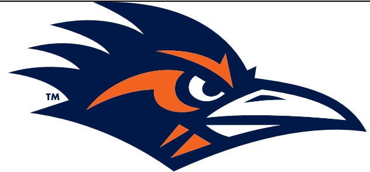

# 2024 UTSA Roadrunners Football UTSA 44, Coastal Carolina 15 Monday, Dec. 23 Brooks Stadium·Conway,S.C. UTSA Postgame Notes

## TEAM RECORDS AND SERIES NOTES

- UTSA improved to 7-6 on the season while Coastal Carolina fell to 6-7.

This marked the first meeting between the two teams.

- UTSA has posted a winning record for the fifth straight year and eighth time in 14 seasons of football.

- This marked the Roadrunners' fifth consecutive and sixth overall bowl appearance.

UTSA now has won back-to-back bowl games for the first time in school history.

Taylor's 46 wins represent the most of any active FBS head coach hired in 2020.

- UTSA improved to 12-7 in weekday games after a victory on the first-ever game played on a Monday.

## TEAM NOTES

- UTSA scored 44 points via four touchdowns and three field goals for the program's bowl scoring record.

The Roadrunners also set bowl benchmarks in total yards with 513, rushing yards with 257 and field goals with three.

UTSA's 29-point margin of victory represents the most in Myrtle Beach Bowl history.

- UTSA logged 10 tackles for loss, pushing their school-record season total to 114.

- The Roadrunners recorded four sacks on the dav.

- UTSA now has registered a sack in 23 straight games.

- UTSA held Coastal Carolina to 98 rushing yards, the ninth opponent this season to rush for 100 or fewer yards.

- UTSA extended its streak of consecutive games with a takeaway to 23 on Jakevian Rodgers' third-quarter interception.

- The Roadrunners finished with 22 takeaways this season.11 fumble recoveries and 11 interceptions.

- UTSA piled up 513 yards,256 in the air and 257 on the ground

This marks the fifth time UTSA has topped 500 yards of offense this season and third time in the past four games.

The Roadrunners have totaled 294 points and 3.486 yards over the past seven games, good for an average of 42 points and 498 yards per contest.

## INDIVIDUAL NOTES

- Sophomore QB Owen McCown tied Frank Harris' Cure Bowl performance with 23 completed passes representing the most by a Roadrunner in a bowl.

McCown went 23-for-30 for 254 yards and a touchdown through the air

He added 37 more yards and a touchdown on the ground.

He is now 2-0 as UTSA's starting quarterback in bowl games.

He finished the season with 3,424 passing yards, the second-most in program history,

His 25 passing touchdowns this season represent the third-most in UTSA annals.

- Senior DL Brandon Brown posted a career-high five tackles and a career-best two sacks, with the latter tying Trey Moore for the most by a Roadrunner in a bowl game.

- He finished the season with 29 tackles,8.5 tackles for loss and 4.0 sacks.

- Sophomore WR David Amador II hauled in seven receptions for 110 yards to lead the team.

He finished the year with 31 receptions, 395 yards and one touchdown in just five games.

Senior ILB Martavius French recorded three tackles, all of which were tackles for loss.

He finished the season with a team-high 80 tackles,17 for loss,which ties him for fourth on UTSA's single-season chart.

- Redshirt freshman Vic Shaw registered four tackles, including a sack and a tackle for loss.

- Redshirt freshman CB Jakevian Rodgers had his first career interception on a fake punt attempt in the third quarter.

- Freshman S Elijah Newell posted a season-high six tackles.

- Senior CB Syrus Dumas registered six tackles.

- Senior KR Chris Carpenter returned a kickoff 93 yards for a touchdown in the fourth quarter, his second kick return TD of the season and third of his career.

He is the only Roadrunner to ever have a kickoff return for a touchdown.

The 93-yard return represents the longest of any Roadrunner in a bowl, surpassing Willie McCoy's long of 23 from the 2023 Frisco Bowl.

- Sophomore PK Tate Sandell made a bowl-record three field goals and four extra points.

His three field goals snapped Victor Falcon's mark of two from the 2016 New Mexico Bowl.

He ended the season 19-of-23 on field goals and 35-of-36 on PATs.

He made all 10 of his last 10 field-goal attempts and is now tied for third on UTSA's single-season chart with 19 FGs.

He also had three touchbacks on the day, pushing his season and career record totals to 62 and 105, respectively.

- Freshman RB Will Henderson III busted out a 51-yard touchdown run in the fourth quarter for the longest rush of his career and his first collegiate touchdown

He led the team with 81 yards on just five attempts.

- Redshirt freshman RB Brandon High Jr. toted the rock 11 times for 76 yards and a score.

- Sophomore WR Devin McCuin hauled in five receptions for 63 yards

## ADDITIONAL NOTES

- UTSA's captains today were senior DL Brandon Brown, senior ILB Martavius French, senior ILB Jamal Ligon and senior DL Asyrus Simon.

- Temperature at kickoff was 41 degrees, making this the third-coldest game UTSA has played in during its 14-year history and trailing only 36 degrees at Army on Nov. 30 and 39 degrees at North Texas on Nov.23,2013.