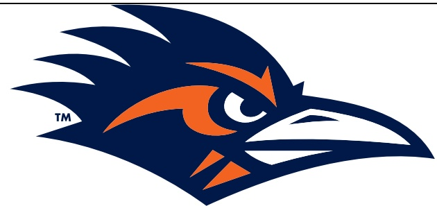

## TEAM RECORDS AND SERIES NOTES

- UTSA improved to 4-5 on the season and 2-3 in American Athletic Conference play, while Memphis fell to 7-2 with a 3-2 mark in league action.

- This marked the second meeting between UTSA and Memphis.

o UTSA leads the all-time series 2-0.

- UTSA has won eight straight and 15 of the last 16 home games.

- The Roadrunners are now 53-30 (.638) all-time in the Alamodome.

- In the Jeff Traylor era, UTSA is now:

o 43-19 (.693) overall.

- Traylor's 43 wins represent the most of any active FBS head coach hired in 2020.

○ 27-3 (.900) at home.

29-7 (.805) in regular-season conference games.

31-7 (.815) versus conference competition when including the 2021 and 2022 Conference USA Championship Games.

## TEAM NOTES

- The victory represented UTSA's first win over a ranked opponent in school history.

- UTSA extended its streak of consecutive games with a takeaway to 19.

- The Roadrunners have registered a sack in 19 straight games.

- UTSA held Memphis to 62 rushing yards, marking the sixth time this season that the Roadrunners have held its opponents to under 100 rushing yards.

- This marked the third consecutive game that UTSA has had multiple tight enos catch a touchdown pass.

## INDIVIDUAL NOTES

- Redshirt sophomore QB Owen McCown completed 20-of-37 passes for 280 yards and four touchdowns.

This marked back-to-back weeks in which McCown passed for four TDs.

He completed passes to 10 different receivers.

This game brings his season totals to 205 completions and 2,364 yards,with a 20-4 touchdown-to-interception rate.

- Senior WR Chris Carpenter posted his second straight 100-yard receiving game with four catches for 108 yards.

His 60-yard reception in the second quarter was the fifth-longest play of the season for UTSA.

Carner also had two punt returns for 44 yards with 23- and 21-vard returns in the third quarter, the two longest of the year.

hirt sophomore TE Houston Thomas caught all six of his targets for 44 yard.

Thomas is the second Roadrunner to record two TD catches in a game this season (Devin McCuin vs. Kennesaw State).

man TE Patrick Overmyer caught two passes for 16 yards and a touchdown.

vR JJ Sparkman had a 38-yard reception in the first quarter, the longest reception of his career.

This beat his previous record of 33, set against TCU in 2022 while at Texas Tech.

- Sophomore WR David Amador II completed a 27-yard pass to Dishman on his first collegiate pass attempt.

- Senior ILB Martavius French recorded 10 total tackles including two for loss.

His 10 tackles ties his career high, and he's reached double-digit stops three times as a Roadrunner.

French leads UTSA this season with 53 total stops.

- Senior ILB Jamal Ligon posted six tackles today, breaking the program's career tackles record in the process.

He now has 317 career tackles to eclipse the previous mark of 315 set by Rashad Wisdom (2019-23).

- Junior S Jermarius Lewis picked off a pass near the end of the third quarter, his first as a Roadrunner and third of his collegiate career.

- His interception gave UTSA a takeaway in the 19th straight game.

- Senior S Elliott Davison logged eight tackles and a pass breakup.

- Senior CB Syrus Dumas posted eight tackles, one forced fumble and a fumble recovery.

- Senior DL Brandon Brown, redshirt freshman Vic Shaw and junior DL Jon Jones all recorded sacks.

- Redshirt sophomore PK Tate Sandell set a school record with his 54-yard field goal in the second quarter.

The previous UTSA record was 53 yards set by Sean Ianno in 2014 and matched by Chase Allen in 2023.

## ADDITIONAL NOTES

- UTSA's captains today were senior WR De'Corian "JT" Clark, senior LS Cade Collenback and senior WR JJ Sparkman.

- UTSA improved to 2-0 when wearing black uniforms. The Roadrunners also donned black in a 31-17 win over North Texas in 2016.

- Today's attendance was 17,198.

UTSA now has drawn 2,073,315 fans for 83 home games in its 14-year history, an average of 24,980 per game.