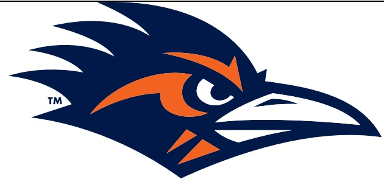

## TEAM RECORDS AND SERIES NOTES

- Texas improved to 3-0 with the win, while UTSA fell to 1-2 on the season.

- Today's game marked the second meeting between UTSA and Texas.

- The Longhorns now own a 2-0 advantage in the series.

- Ranked No.2 in the AP Top 25 and No.3 in the AFCA Coaches Poll, Texas is the highest-ranked team UTSA has played in its 14-year history.

- UTSA is now 40-16 (.714) under fifth-year head coach Jeff Traylor.

- UTSA is now 35-22 all-time — 15-6 under Traylor — against teams from the state of Texas.

- The Roadrunners are now 9-3 over their last 12 games.

## TEAM NOTES

- The Roadrunners forced two turnovers, an interception by Owen Pewee and a fumble recovery by Tyan Milton.

UTSA has four total takeaways this season, two fumble recoveries and a pair of interceptions.

UTSA now has come up with a takeaway in 13 consecutive games dating back to last September.

- UTSA rushed for a season-high 128 yards.

- The Roadrunners won the possession battle, holding the football for 31:01 minutes to the Longhorns' 28:59.

## INDIVIDUAL NOTES

- Senior ILB Martavius French logged seven tackles to lead UTSA.

He now has 13 stops on the season, slotting him just behind Ken Robinson (14), Brevin Randle (14) and Elliot Davison (14) for the team lead.

- Senior ILB Jamal Ligon, senior ILB Brevin Randle, senior S Elliott Davison and sophomore S Jimmy Wyrick registered five tackles apiece.

- Senior $B Donvai Tavlor recorded three tackles and a sack for a 10-yard loss in his first appearance of the season.

- Sophomore $B Owen Pewee had an interception return of 11 yards in the first quarter, the second INT of his career.

- Senior RB Robert Henry Jr. rushed for 65 yards on six attempts.

His 53-yard TD run in the second quarter is the longest rush of his career.

He now has rushed for a team-high 121 yards this season.

He now has 12 career rushing TDs, tied for ninth in school history.

- Sophomore QB Owen McCown completed 21-of-29 passes for 132 yards.

McCown completed passes to 12 different receivers.

- Sophomore WR Devin McCuin led the receiving corps, hauling in five passes on five targets for 27 yards.

McCuin leads UTSA with 22 receptions and 135 yards this season.

- Sophomore WR Jace Wilson had a career-high two receptions for 14 yards.

- Freshman RB Brandon High Jr. rushed for 27 yards on seven carries, both career highs.

## ADDITIONAL NOTES

- UTSA's captains were junior CB Zah Frazier, senior ILB Martavius French and senior S Elliott Davison.

- Tonight's attendance was 101,892, marking the fourth-largest crowd to see a UTSA game.