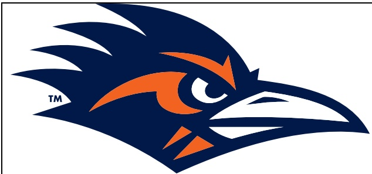

## TEAM RECORDS AND SERIES NOTES

- UTSA improved to 5-5 overall and 3-3 in American Conference play. Charlotte fell to 1-9 and 0-7.

This marked the third meeting and UTSA now leads the series, 3-0.

- The Roadrunners are 37-52 (.416) in road games.

- UTSA is now 62-45 (.579) in conference games.

The Roadrunners are 14-8 (.636) in American Conference games.

- The win was UTSA's first conference road victory since a 37-29 decision at North Texas on Nov.4,2023.

- The Roadrunners are 9-12 (.429) in games played in the Eastern time zone.

- Head coach Jeff Traylor is 51-25 (.671) overall (since 2020).

He is 34-11 (.756) in conference games including 14-8 (.636) in the American Conference.

He is 17-4 (.801) in the month of November.

## TEAM NOTES

- The Roadrunners held Charlotte to 197 yards of offense, a season low for an opponent.

- UTSA did not surrender an offensive touchdown for the first time since Oct. 21, 2023, against Florida Atlantic.

- UTSA did not allow Charlotte to cross midfield until midway through the third quarter, and the 49ers did not reach the red zone until the fourth.

- UTSA posted three sacks and now has a sack in 32 of the last 33 games.

The Roadrunners have logged multiple sacks for the fifth time this season and have registered three or more for the third time.

- UTSA now has a takeaway in 29 of the last 33 games after an interception in the fourth quarter.

- The Roadrunners registered 521 yards of total offense,306 through the air and 215 on the ground.

UTSA has surpassed 500 yards of total offense twice this season after charting 523 against Tulane on Oct. 30, 2025.

- UTSA scored on its first offensive possession for the fifth time in the last six games.

- The Roadrunners had a 300-yard passer,100-yard rusher and a 100-yard receiver in the same game for the first time since Nov.15,2024 vs.North Texas.

## INDIVIDUAL NOTES

- Junior QB Owen McCown completed 24-of-37 passes for 306 yards, logging two passing touchdowns and one on the ground.

It marked his second 300-yard game of the season and sixth of his career.

- Junior WR Devin McCuin piled up a career-high 100 receiving yards and a touchdown on seven catches.

- It marked his first career 100-yard receiving game and the third by a Roadrunner this season.

- Redshirt freshman RB Will Henderson III rushed for a career-high 185 yards

It marked his second 100-yard rushing game of the season and UTSA's seventh.

His total is the most rushing yards by a Roadrunner this season and the sixth-most in program history.

He became the first Roadrunner to reach 185 rushing yards since Sincere McCormick scampered for 204 against Western Kentucky on Dec.3,2021.

His 59-yard TD rush in the third quarter is a career long, eclipsing a 57-yard run in the win over Rice on Oct.11.

- Junior WR AJ Wilson hauled in five passes for 87 yards, including 70 yards after the catch.

- Sophomore WR David Amador II caught four passes for 31 yards and a score.

- Redshirt junior TE Houston Thomas caught four passes for 54 yards.

- Senior ILB Shad Banks Jr. posted a team-high eight tackles.

- Senior S Tyan Milton recorded six tackles, including one ror loss, and an interception.

Milton's pick was his second of the season.

- Redshirt freshman DL Kenny Ozowalu recorded two tackles and a sack.

- Senior DL Jon Jones posted two tackles and a sack.

- Redshirt freshman ILB James Walley Jr. logged his first sack of the season.

## ADDITIONAL NOTES

- UTSA's captains today were senior ILB Shad Banks Jr., junior DL Tai Leonard, junior $B Owen Pewee and senior OL Trevor Timmons.

- The Roadrunners wore blue helmets, white jerseys and white pants, and the record now stands at 9-13 in that uniform combination.

- This is the 15th season of UTSA Football. The Roadrunners' all-time record now sits at 96-86 (.528).