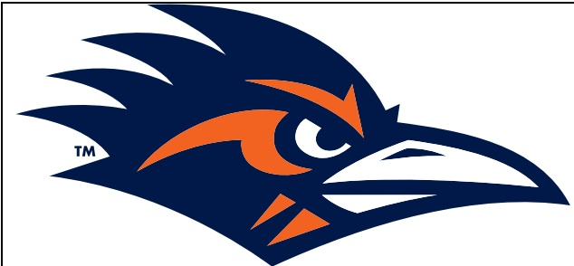

## TEAM RECORDS AND SERIES NOTES

- UTSA fell to 0-2. Texas State improved to 2-0.

o UTSA saw its school record-tying 10-game winning streak snapped with the loss.

The Roadrunners are now 9-6 in home openers.

UTSA leads the series, 5-2, including 3-1 at the Alamodome.

o UTSA is 37-25 versus teams from the state of Texas.

- Head coach Jeff Traylor is 46-22 (.676) overall.

Traylor is 4-2 in home openers.

He is 17-9 versus teams from the state of Texas.

## TEAM NOTES

- The Roadrunners now have scored 20-or-more points in 12 straight games.

- UTSA now has registered a takeaway and a sack in 24 of the past 25 games.

- The Roadrunners recorded 464 yards of total offense; 245 on the ground and 219 through the air.

- UTSA racked up 25 first downs, marking the most since earning 23 against Coastal Carolina on Dec. 23, 2024, in the Myrtle Beach Bowl.

- Texas State's safety in the first quarter marked the first time UTSA allowed a safety since Sept. 26, 2015, against Colorado State.

- 16 different Roadrunners recorded tackles, with 14 logging more than one.

## INDIVIDUAL NOTES

- Senior RB Robert Henry Jr. logged his fourth straight 100-yard game on the ground with 159 yards on 17 carries and two scores.

Henry's rushing total was one yard shy of his career best at Temple on Nov. 22, 2024.

His career-high three touchdowns - all in the second half - allowed him to tie the program record for points scored in a game, charting 18.

- It is his fourth consecutive game scoring at least two rushing touchdowns.

- He has recorded at least 2 scores in a game in six career outings.

He added 21 receiving yards and a touchdown reception for a game-high 180 yards of total offense.

His 75-yard third quarter scamper tied his 75-yard rush against Texas A&M on Aug.30 for UTSA's longest play this season.

Henry is the first Roadrunner to top the century mark in four consecutive contests since Kevorian Barnes over the final two games of the 2022 season and the first two in 2023.

o In the last tour games combined, Henry has registered 682 yards, nine total TDs (8 rushing) and four runs of 75-or-more yards.

- Redshirt junior QB Owen McCown completed 23-of-43 passes for 219 yards and two touchdowns, rushing for 55 yards on seven carries.

- Junior WR Devin McCuin tallied 83 yards on five catches - the most for a UTSA receiver this year - and registered a rush of 12 yards.

- Redshirt freshman RB Will Henderson III ran the ball five times for 49 yards and caught three passes on three targets for 16 yards.

- Redshirt junior TE Houston Thomas hauled in four receptions for 36 yards.

- Making his first career start, junior WR DJ Allen caught two passes, including his second career TD reception.

- Senior ILB Shad Banks Jr. posted nine total tackles, including a tackle for loss, and had his second career interception — his first as a Roadrunner and the first for UTSA this season — in the first quarter.

- Redshirt sophomore S Jimmy Wyrick posted a career-high stops in back-to-back games, with five tackles against Texas A&M and six against Texas State.

- Redshirt freshman DL Kenny Ozuwalu registered his first collegiate sack.

- Senior S Tyan Milton set a new career high with six tackles, including one for loss.

## ADDITIONAL NOTES

- UTSA's captains today were junior QB Owen McCown, junior WR Devin McCuin and junior TE Houston Thomas.

- The attendance was 45,778, the third-largest UTSA home crowd in program history.

Saturday's attendance was the second-largest UTSA home crowd against an NCAA DI FBS opponent.

The top two NCAA DI FBS home crowds for UTSA are now against Texas State.

- The Roadrunners wore blue helmets, orange jerseys and orange pants, their record now standing at 3-4 in that uniform combination.

- This is the 15th season of UTSA Football. The Roadrunners' all-time record now sits at 91-83 (.523).

- The game accumulated the second-most combined points in series history,second to the 2020 matchup that recorded 99 total points,with UTSA winning 51-28 in double OT.

- The Roadrunners successfully converted a two-point try in the fourth quarter. The last time UTSA achieved such a feat was on Sept.15,2023 against Army.